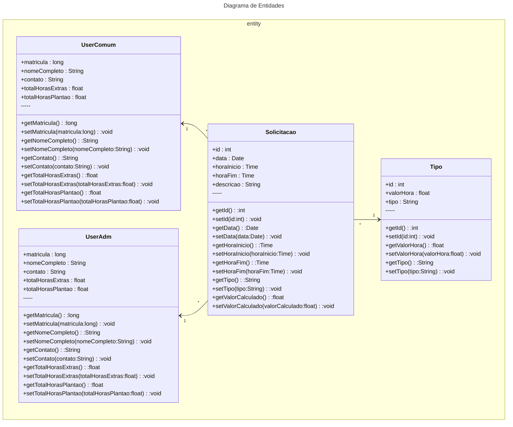

Fábrica de Software 2025/1

# Propostas de projeto
### Nome do sistema: Api de divulgação de informações pelos representantes

Funcionalidade 1 

Funcionalidade 2 

Funcionalidade 3

### Nome do sistema: Api de gerenciamento de horas de funcionários

Funcionalidade 1 

Funcionalidade 2 

Funcionalidade 3

-----Aula 05/08-----

JRE - Java Runtime Enviroment

Ambiente mínimo para executar um programa Java
JVM - Java Virtual Machine (java.exe ou javaw.exe)
JDK - Java Development Kit

Adoptium JDK
Ambiente de DESENVOLVIMENTO (javac.exe) compilador
COMPILAÇÃO

Escreve um programa em java (arquivo.java)
Compilação arquivo.java -> javac.exe -> bytecode arquivo.class
EXECUÇÃO 3) Passar .class -> java.exe (JVM) -> ling máquina

VSCode

VSCode
Java Extension Pack

-----Aula 12/08-----
# Histórias de usuário:

### Usuário comum: Funcionário
### Usuário privilegiado: Supervisor / chefe
### Usuário administrativo: RH / TI

Como usuário comum eu gostaria de registrar horas extras de trabalho

Como usuário comum eu gostaria de registrar plantões de trabalho

Como usuário comum eu gostaria de poder visualizar minhas horas extras de trabalho

Como usuário comum eu gostaria de visualizar um gráfico com meu histórico de horas extras e plantoes

Como usuário comum eu gostaria de poder logar em diferentes dispositivos

Como usuário comum eu gostaria de poder visualizar meu espelho ponto num período de 2 anos

Como usuário comum eu gostaria de poder solicitar ao RH um novo cadastro com minha matrícula

-----

Como usuário administrativo eu gostaria de poder cadastrar novos funcionários

Como usuário administrativo eu gostaria de visualizar os funcionários cadastrados

Como usuário administrativo eu gostaria poder remover funcionários cadastrados mediante a solicitações

Como usuário administrativo eu gostaria de poder visualizar horas extras de funcionários

Como usuário administrativo eu gostaria de aprovar solicitações de horas extras dos funcionários

Como usuário administrativo eu gostaria de aprovar solicitações de plantões dos funcionários

Como usuário administrativo eu gostaria de poder adicionar ao sistema o espelho ponto dos funcionários

Como usuário administrativo eu gostaria de poder realizar modificações nos cadastros dos funcionários consensual

Como usuário administrativo eu gostaria de registrar horas extras de trabalho

Como usuário administrativo eu gostaria de registrar plantões de trabalho

Como usuário administrativo eu gostaria de poder visualizar minhas horas extras de trabalho

Como usuário administrativo eu gostaria de visualizar um gráfico com meu histórico de horas extras e plantoes

Como usuário administrativo eu gostaria de poder logar em diferentes dispositivos

Como usuário administrativo eu gostaria de poder visualizar meu espelho ponto num período de 2 anos

-----Aula 19/08-----

    

